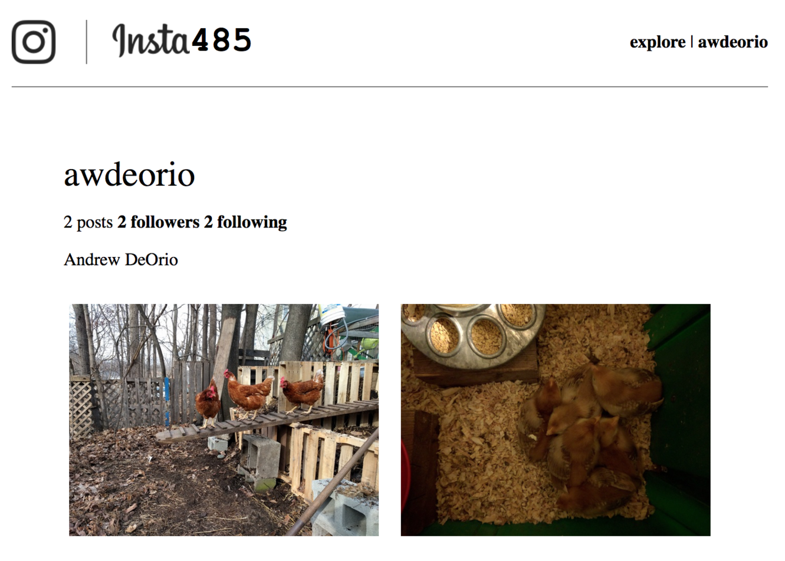

# Instagram Clone Project

## Disclaimer
This repo is just a display of a course project for EECS 485 Web Systems @ University of Michigan. I'm excluding the code to comply with academic integrity policies.

## Technologies Used
- **Frontend**: React, JavaScript, HTML, CSS  
- **Backend**: Python Flask, REST API, SQLite
- **Architecture**: Client-side dynamic pages
- **Testing**: Cypress
- **Deployment**: AWS (EC2)

## Project Overview
Instagram clone implementation featuring:
- **Client-Side Dynamic Pages**: Dynamic DOM updates via JavaScript.  
- **REST API Integration**: Backed by a Flask REST API.  
- **Infinite Scroll**: Seamlessly load additional posts while scrolling.
- **User Interaction**: Like, comment, and delete actions without reloading the page.
- **AJAX Calls**: Asynchronous data retrieval for real-time updates.
- **User Authentication**: Secure login using session cookies or HTTP Basic Auth.
- **Account Creation**: Users can sign up with a username and password, stored in a SQLite database.

## System Architecture
### Client-Side Dynamic Pages
- The client application runs JavaScript in the browser to render and update pages dynamically.  
- Data is fetched from the Flask REST API via **AJAX calls** and used to modify the DOM.  
- This enables features like infinite scrolling, real-time likes, and more.

### REST API
The backend provides RESTful endpoints for key operations:
- **Posts**: Retrieve, paginate, and filter posts.
- **Likes**: Add or delete likes.
- **Comments**: Add or delete comments.
- **Authentication**: Supports both session cookies and HTTP Basic Access Authentication.

### Authentication Protocols
The project implements two main authentication methods:
- **Session Cookies**: A secure mechanism to maintain user sessions. It allows users to remain authenticated between actions without repeatedly entering credentials.
- **HTTP Basic Authentication**: Utilized for direct API requests, requiring credentials to be included in the request headers. Unauthorized actions are blocked with appropriate error codes (403 for forbidden and 404 for non-existent resources).

## Code Tree

<pre>
├── .eslintrc.js
├── .gitignore
├── .prettierignore
├── .prettierrc.json
├── .pytest_cache
│   ├── .gitignore
│   ├── CACHEDIR.TAG
│   ├── README.md
│   └── v
│       └── cache
│           ├── lastfailed
│           ├── nodeids
│           └── stepwise
├── bin
│   ├── insta485db
│   ├── insta485install
│   ├── insta485run
│   └── insta485test
├── cookies.txt
├── cypress.config.js
├── deployed_bundle.js
├── deployed_bundle.log
├── deployed_index.html
├── deployed_index.log
├── eecs485deploy2.pem
├── insta485
│   ├── __init__.py
│   ├── api
│   │   ├── __init__.py
│   │   └── posts.py
│   ├── config.py
│   ├── js
│   │   ├── main.jsx
│   │   └── post.jsx
│   ├── model.py
│   ├── static
│   │   ├── css
│   │   │   └── style.css
│   │   ├── images
│   │   └── js
│   │       ├── bundle.js
│   │       └── bundle.js.map
│   ├── templates
│   │   ├── auth.html
│   │   ├── create.html
│   │   ├── delete.html
│   │   ├── edit.html
│   │   ├── explore.html
│   │   ├── followers.html
│   │   ├── following.html
│   │   ├── index.html
│   │   ├── login.html
│   │   ├── password.html
│   │   ├── post.html
│   │   └── user.html
│   └── views
│       ├── __init__.py
│       └── index.py
├── p3-insta485-clientside
│   ├── .eslintrc.js
│   ├── .gitignore
│   ├── .prettierignore
│   ├── .prettierrc.json
│   ├── bin
│   │   ├── insta485db
│   │   ├── insta485install
│   │   ├── insta485run
│   │   └── insta485test
│   ├── cypress.config.js
│   ├── insta485
│   │   ├── __init__.py
│   │   ├── api
│   │   │   ├── __init__.py
│   │   │   └── posts.py
│   │   ├── config.py
│   │   ├── js
│   │   │   ├── main.jsx
│   │   │   └── post.jsx
│   │   ├── model.py
│   │   ├── static
│   │   │   └── css
│   │   │       └── style.css
│   │   ├── templates
│   │   │   ├── auth.html
│   │   │   ├── create.html
│   │   │   ├── delete.html
│   │   │   ├── edit.html
│   │   │   ├── explore.html
│   │   │   ├── followers.html
│   │   │   ├── following.html
│   │   │   ├── index.html
│   │   │   ├── login.html
│   │   │   ├── password.html
│   │   │   ├── post.html
│   │   │   └── user.html
│   │   └── views
│   │       ├── __init__.py
│   │       └── index.py
│   ├── package-lock.json
│   ├── package.json
│   ├── pyproject.toml
│   ├── requirements.txt
│   ├── sql
│   │   ├── data.sql
│   │   ├── schema.sql
│   │   └── uploads
│   │       ├── 122a7d27ca1d7420a1072f695d9290fad4501a41.jpg
│   │       ├── 2ec7cf8ae158b3b1f40065abfb33e81143707842.jpg
│   │       ├── 505083b8b56c97429a728b68f31b0b2a089e5113.jpg
│   │       ├── 5ecde7677b83304132cb2871516ea50032ff7a4f.jpg
│   │       ├── 73ab33bd357c3fd42292487b825880958c595655.jpg
│   │       ├── 9887e06812ef434d291e4936417d125cd594b38a.jpg
│   │       ├── ad7790405c539894d25ab8dcf0b79eed3341e109.jpg
│   │       └── e1a7c5c32973862ee15173b0259e3efdb6a391af.jpg
│   ├── test_cypress_hello.cy.js
│   ├── test_cypress_hello.cy.js.1
│   ├── tests
│   │   ├── conftest.py
│   │   ├── cypress
│   │   │   ├── e2e
│   │   │   │   ├── test_index_public.cy.js
│   │   │   │   ├── test_scroll_public.cy.js
│   │   │   │   └── test_slow_server_index_public.cy.js
│   │   │   ├── fixtures
│   │   │   │   ├── posts
│   │   │   │   │   ├── 1.json
│   │   │   │   │   ├── 10.json
│   │   │   │   │   ├── 11.json
│   │   │   │   │   ├── 12.json
│   │   │   │   │   ├── 13.json
│   │   │   │   │   ├── 14.json
│   │   │   │   │   ├── 15.json
│   │   │   │   │   ├── 16.json
│   │   │   │   │   ├── 17.json
│   │   │   │   │   ├── 18.json
│   │   │   │   │   ├── 19.json
│   │   │   │   │   ├── 2.json
│   │   │   │   │   ├── 20.json
│   │   │   │   │   ├── 21.json
│   │   │   │   │   ├── 22.json
│   │   │   │   │   ├── 23.json
│   │   │   │   │   ├── 24.json
│   │   │   │   │   ├── 25.json
│   │   │   │   │   ├── 26.json
│   │   │   │   │   ├── 27.json
│   │   │   │   │   ├── 28.json
│   │   │   │   │   ├── 29.json
│   │   │   │   │   ├── 3.json
│   │   │   │   │   ├── 30.json
│   │   │   │   │   ├── 31.json
│   │   │   │   │   ├── 32.json
│   │   │   │   │   ├── 4.json
│   │   │   │   │   ├── 5.json
│   │   │   │   │   ├── 6.json
│   │   │   │   │   ├── 7.json
│   │   │   │   │   ├── 8.json
│   │   │   │   │   └── 9.json
│   │   │   │   ├── posts_page_0.json
│   │   │   │   ├── posts_page_0_new_posts.json
│   │   │   │   ├── posts_page_1.json
│   │   │   │   ├── posts_page_2.json
│   │   │   │   └── uploads
│   │   │   │       ├── 0d02a5a4bb6b460abf9160522ad9d324.png
│   │   │   │       └── 4ef62485e76c4320af6085ac7822cc57.png
│   │   │   └── support
│   │   │       ├── commands.js
│   │   │       └── e2e.js
│   │   ├── test_rest_api_likes_and_comments.py
│   │   ├── test_rest_api_posts.py
│   │   ├── test_rest_api_simple.py
│   │   ├── test_scripts.py
│   │   ├── test_style.py
│   │   ├── testdata
│   │   │   ├── eslintrc.js -> ../../.eslintrc.js
│   │   │   └── fox.jpg
│   │   └── utils.py
│   ├── tsconfig.json
│   ├── webpack.config.js
│   └── wsl
├── package-lock.json
├── package.json
├── pyproject.toml
├── requirements.txt
├── sql
│   ├── data.sql
│   ├── schema.sql
│   └── uploads
│       ├── 122a7d27ca1d7420a1072f695d9290fad4501a41.jpg
│       ├── 2ec7cf8ae158b3b1f40065abfb33e81143707842.jpg
│       ├── 505083b8b56c97429a728b68f31b0b2a089e5113.jpg
│       ├── 5ecde7677b83304132cb2871516ea50032ff7a4f.jpg
│       ├── 73ab33bd357c3fd42292487b825880958c595655.jpg
│       ├── 9887e06812ef434d291e4936417d125cd594b38a.jpg
│       ├── ad7790405c539894d25ab8dcf0b79eed3341e109.jpg
│       └── e1a7c5c32973862ee15173b0259e3efdb6a391af.jpg
├── submit.tar.gz
├── test_cypress_hello.cy.js
├── test_cypress_hello.cy.js.1
├── tests
│   ├── conftest.py
│   ├── cypress
│   │   ├── e2e
│   │   │   ├── test_cypress_hello.cy.js
│   │   │   ├── test_index_public.cy.js
│   │   │   ├── test_scroll_public.cy.js
│   │   │   └── test_slow_server_index_public.cy.js
│   │   ├── fixtures
│   │   │   ├── posts
│   │   │   │   ├── 1.json
│   │   │   │   ├── 10.json
│   │   │   │   ├── 11.json
│   │   │   │   ├── 12.json
│   │   │   │   ├── 13.json
│   │   │   │   ├── 14.json
│   │   │   │   ├── 15.json
│   │   │   │   ├── 16.json
│   │   │   │   ├── 17.json
│   │   │   │   ├── 18.json
│   │   │   │   ├── 19.json
│   │   │   │   ├── 2.json
│   │   │   │   ├── 20.json
│   │   │   │   ├── 21.json
│   │   │   │   ├── 22.json
│   │   │   │   ├── 23.json
│   │   │   │   ├── 24.json
│   │   │   │   ├── 25.json
│   │   │   │   ├── 26.json
│   │   │   │   ├── 27.json
│   │   │   │   ├── 28.json
│   │   │   │   ├── 29.json
│   │   │   │   ├── 3.json
│   │   │   │   ├── 30.json
│   │   │   │   ├── 31.json
│   │   │   │   ├── 32.json
│   │   │   │   ├── 4.json
│   │   │   │   ├── 5.json
│   │   │   │   ├── 6.json
│   │   │   │   ├── 7.json
│   │   │   │   ├── 8.json
│   │   │   │   └── 9.json
│   │   │   ├── posts_page_0.json
│   │   │   ├── posts_page_0_new_posts.json
│   │   │   ├── posts_page_1.json
│   │   │   ├── posts_page_2.json
│   │   │   └── uploads
│   │   │       ├── 0d02a5a4bb6b460abf9160522ad9d324.png
│   │   │       └── 4ef62485e76c4320af6085ac7822cc57.png
│   │   ├── screenshots
│   │   │   └── test_index_public.cy.js
│   │   │       └── failed.png
│   │   ├── support
│   │   │   ├── commands.js
│   │   │   └── e2e.js
│   │   └── videos
│   │       ├── test_cypress_hello.cy.js.mp4
│   │       └── test_index_public.cy.js.mp4
│   ├── test_rest_api_likes_and_comments.py
│   ├── test_rest_api_posts.py
│   ├── test_rest_api_simple.py
│   ├── test_scripts.py
│   ├── test_style.py
│   ├── testdata
│   │   ├── eslintrc.js -> ../../.eslintrc.js
│   │   └── fox.jpg
│   └── utils.py
├── tsconfig.json
├── var
│   ├── insta485.sqlite3
│   └── uploads
│       ├── 122a7d27ca1d7420a1072f695d9290fad4501a41.jpg
│       ├── 2ec7cf8ae158b3b1f40065abfb33e81143707842.jpg
│       ├── 505083b8b56c97429a728b68f31b0b2a089e5113.jpg
│       ├── 5ecde7677b83304132cb2871516ea50032ff7a4f.jpg
│       ├── 73ab33bd357c3fd42292487b825880958c595655.jpg
│       ├── 9887e06812ef434d291e4936417d125cd594b38a.jpg
│       ├── ad7790405c539894d25ab8dcf0b79eed3341e109.jpg
│       └── e1a7c5c32973862ee15173b0259e3efdb6a391af.jpg
├── webpack.config.js
└── wsl
</pre>
